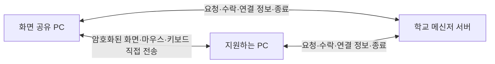

# 원격 지원을 교직원 PC 직접 연결로 변경

## 목적

여러 교직원이 동시에 원격 지원을 사용해도 학교 메신저 서버에 화면 트래픽이 모이지 않게 한다. 현재 화면 캡처·JPEG 압축·표시·Windows 입력 처리는 이미 두 교직원 PC에서 수행한다. 변경 대상은 화면과 입력의 전송 경로다.

## 역할

- 학교 서버: 로그인·접속 상태, 지원 요청과 상대 수락, 연결 정보 교환, 제어 권한 변경, 종료·계정 변경·시간 만료를 관리한다.
- 화면 공유 PC: 화면 캡처·압축, 직접 연결 수신, 승인된 입력 적용을 담당한다.
- 지원하는 PC: 공유 PC에 직접 연결하고 화면 복원·표시, 마우스·키보드 입력 전송을 담당한다.

화면과 입력은 학교 서버에 보내지 않는다. 기존 서버의 Frame·Input 중계 메서드를 제거하고, 원격 Hub의 대용량 버퍼 설정도 줄인다. 서버 연결은 지원 중에도 유지하여 계정 비활성화·권한 해제·종료를 전달한다.

## 전송 방식

교내 PC 간 TCP 연결과 .NET SslStream을 사용한다. 현재 WPF와 JPEG 캡처 코드를 재사용하고 새 원격지원 제품이나 영상 라이브러리를 추가하지 않는다. 화면 공유 PC가 수락 후 임시 포트에서 대기하고, 지원하는 PC가 접속한다. 임시 수신 소켓은 지원 종료 시 닫는다.

대안인 WebRTC는 직접 연결과 실시간 영상에 적합하지만 현재 WPF 프로그램에 별도 라이브러리·런타임을 통합해야 한다. 현재 화면 품질·속도를 유지하면서 서버 트래픽을 없애는 목표에는 표준 .NET 직접 연결을 선택한다. 외부 STUN·TURN 서버는 사용하지 않는다.

## 연결과 인증

각 세션에서 PC가 임시 인증서를 만들고 공개 인증서의 SHA-256 지문을 로그인된 서버 연결로 교환한다. 두 PC는 상대 인증서를 해당 지문과 대조하여 확인하고 TLS로 통신한다. 임시 개인키를 서버에 보내지 않으며 임의 인증서를 허용하는 검증 방식은 사용하지 않는다. 메신저 서버의 기존 HTTPS 인증서 검증은 유지한다.

서버는 승인된 두 연결만 연결 정보를 등록하거나 조회할 수 있게 한다. 상대 주소는 서버가 관측한 실제 접속 주소를 사용하고, 임의의 외부 IP를 지정하여 접속시키지 못하게 한다. 지문·접속 정보는 지원 세션에만 연결하며 제3의 교직원에게 제공하지 않는다. 지원 중 IP 주소나 네트워크가 달라지면 다시 요청한다.

기존 수락 절차, 화면 보기·제어 허용 구분, 계정당 한 건, 요청 60초·지원 30분 제한은 유지한다. 공유 PC가 입력을 적용하기 전에도 현재 제어 허용 상태를 검사한다. 서버 연결 또는 직접 연결 중 하나라도 끊기면 화면 전송과 입력 처리를 중단한다. 종료된 지원은 자동 복원하지 않는다.

화면 프레임은 기존 256KB 이하·초당 최대 2장 제한을 유지하고, 입력은 별도 작은 메시지로 처리한다. 잘못된 길이·형식·권한을 거부하고, 송신이 밀리면 오래된 화면을 쌓아 두지 않는다. 서버가 재시작되거나 로그아웃·계정 변경으로 종료를 알리면 직접 연결도 닫는다.

## 학교 네트워크 조건

두 교직원 PC 사이의 직접 통신이 허용되어야 한다. Windows 방화벽이나 교내 VLAN·Wi-Fi 단말 격리가 이를 막으면 학교 정보담당자의 설정이 필요하다. 다른 망에 있어도 양쪽 사이에 경로와 방화벽 허용이 있으면 직접 연결할 수 있다.

배포본에는 교사용 실행 파일과 학교에서 지정한 교직원망 주소만 허용하는 방화벽 설정 스크립트 및 사용법을 포함한다. 에이전트가 현재 PC의 방화벽을 자동으로 변경하지 않는다. 정보담당자가 검토한 뒤 관리자 권한으로 적용한다. 인터넷 포트 포워딩은 요구하지 않는다.

직접 연결이 불가능하면 연결 시간 제한 후 원인을 안내한다. 화면을 서버로 자동 우회하지 않는다. 방화벽 설정을 하지 않아도 쪽지·채팅·설문은 기존처럼 학교 서버로 사용할 수 있다.

## 검증과 배포

- 실제 두 앱 연결로 직접 화면 전송과 Windows 입력 도착을 확인한다.
- 다른 교직원의 연결 정보 조회, 수락 전 연결 정보 등록, 잘못된 인증서 지문·세션 인증, 잘못된 메시지와 과도한 입력을 차단한다.
- 제어 허용 해제, 직접 연결 단절, 서버 연결 단절, 로그아웃, 계정 비활성화, 시간 만료에서 직접 연결과 입력을 중단한다.
- 서버 원격 Hub에 화면·입력 중계 메서드가 남아 있지 않은지 검증한다.
- 기존 쪽지·채팅·설문·계정 승인·자동 로그인 검증을 함께 수행하고 Windows 배포 파일을 갱신한다.

변경 시 서버와 교사용 앱을 함께 업데이트한다. 기존 계정·쪽지·설문·대화 데이터에는 변경이 없다. 학교의 실제 PC 두 대로 방화벽과 네트워크 경로를 최종 확인한다.

[.NET SslStream](https://learn.microsoft.com/en-us/dotnet/api/system.net.security.sslstream)

[Windows 방화벽의 프로그램·원격 주소 제한](https://learn.microsoft.com/en-us/powershell/module/netsecurity/new-netfirewallrule)
